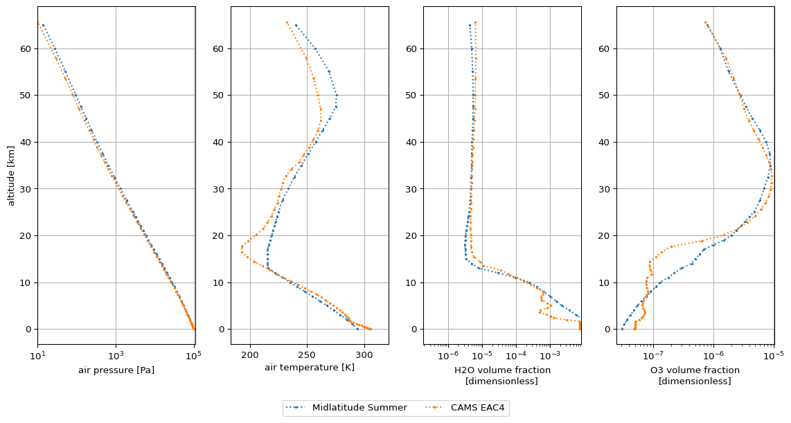

# Tutorials

## CAMS reanalysis datasets

In this tutorial series, we will show how the 
[reanalysis datasets](https://confluence.ecmwf.int/display/CKB/CAMS%3A+Reanalysis+data+documentation#heading-Guidelines) from the Copernicus Atmosphere Monitoring 
Service (CAMS) can be used to :

1. Rescale a standard profile, i.e. modify a standard profile by rescaling the 
  molecular total column densities to match the CAMS values.

2. Create a profile, i.e. create a new atmospheric profile entirely from CAMS 
   multi-levels data.

### Prerequisites

To convert CAMS data to *Joseki* profiles, it is required to download the CAMS 
data from the 
[Atmospheric Data Store](https://ads.atmosphere.copernicus.eu/#!/home) 
beforehand.

For convenience, this tutorial series makes use of two CAMS datasets that are 
part of *Joseki*'s tests suite:


```python
from joseki.tests_util import find_test_data

test_eac4_single_level_data = find_test_data(
    "232f85b4-b3e9-47a7-a52d-9f955c38b9f6.nc"
)

test_eac4_multi_level_data = find_test_data(
    "97da7a58-674a-4a1f-a92b-534cb95d07bb.zip"
)
```

For the purposes of these tests, and to reduce the datasets size, the latter
have a very limited coverage in time, space and include a limited number of data variables.

### Setup

We will need the following imports:


```python
import joseki

from joseki.profiles.cams import from_cams_reanalysis, get_molecule_amounts
```

For visualization purposes, we will use the [matplotlib](https://matplotlib.org) library. As it is not part of `joseki` dependencies, you will have to install it. 


```python
import matplotlib.pyplot as plt
```

In this tutorial series, we will choose the below time and geographical coordinates specifications.


```python
TIME = "2020-07-01T12:00:00.000000000"
LATITUDE = 23.42
LONGITUDE = 27.67
```

### 1. Rescale a standard profile

In this example, we update the *AFGL (1986) Midlatitude Summer* profile so that the total H2O and O3 amounts match with the CAMS data. We start by creating the standard profile:


```python
midlatitude_summer = joseki.make("afgl_1986-midlatitude_summer")
```

The H2O and O3 total amounts can be extracted from the CAMS reanalysis data 
with [`get_molecule_amounts`](reference.md#src.joseki.profiles.cams.get_molecule_amounts):


```python
cams_amounts = get_molecule_amounts(
    test_eac4_single_level_data,
    time=TIME,
    lon=LONGITUDE,
    lat=LATITUDE,
)
```

The *AFGL (1986) Midlatitude Summer* is rescaled to these amounts with 
[`rescale_to`](reference.md#src.joseki.accessor.JosekiAccessor.rescale_to):  


```python
rescaled = midlatitude_summer.joseki.rescale_to(target=cams_amounts)
```

In order to visualize the difference between the original and rescaled profile,
the below code may be used:


```python
fig, _ = plt.subplots(figsize=(6, 6), dpi=96, sharey=True)

params = {
   "ls": "dotted",
   "marker": ".",
   "markersize": 3,
   "y": "z",
}

# Water vapour
plt.subplot(1, 2, 1)
midlatitude_summer.x_H2O.plot(
   **params,
   label="Midlatitude Summer",
   xscale="log",
)
rescaled.x_H2O.plot(**params, label="CAMS EAC4")
plt.ylabel("")
plt.xlim([
   0.95 * min(rescaled.x_H2O.min(), midlatitude_summer.x_H2O.min()),
   1.1 * rescaled.x_H2O.max()
])
plt.grid()

# Ozone
plt.subplot(1, 2, 2)
midlatitude_summer.x_O3.plot(
   **params,
   label="Midlatitude Summer",
   xscale="log",
)
rescaled.x_O3.plot(**params, label="CAMS EAC4")
plt.ylabel("")
plt.xlim([0.5 * rescaled.x_O3.min(), 1.1 * rescaled.x_O3.max()])
plt.grid()

ax = plt.gca()
handles, labels = ax.get_legend_handles_labels()
fig.legend(handles, labels, ncol=2, loc='upper center', bbox_to_anchor=(0.5, 0))


plt.tight_layout()
plt.show()
```


### 2. Create a profile

To create a profile entirely from CAMS data, we use the EAC4 multi-level data.


```python
ds = from_cams_reanalysis(
    data=test_eac4_multi_level_data,
    time=TIME,
    lon=LONGITUDE,
    lat=LATITUDE,
    identifier="EAC4",
)
```

The resulting dataset complies with [*Joseki*'s format](explanation.md#data-set-format).

For more advanced usage, 
[`from_cams_reanalysis`](reference.md#src.joseki.profiles.cams.from_cams_reanalysis)
provides more options such as altitude extrapolation and regularisation.

Visualize the difference with the standard Midlatitude Summer profile with
the below code:


```python
fig, _ = plt.subplots(figsize=(12, 6), dpi=96, sharey=True)

params = {
   "ls": "dotted",
   "marker": ".",
   "markersize": 3,
   "y": "z",
}

cams_z_max = ds.z.values.max()
cams_z_mask = midlatitude_summer.z < cams_z_max

# Pressure
plt.subplot(1, 4, 1)
midlatitude_summer.p.where(cams_z_mask).plot(
   **params,
   label="Midlatitude Summer",
   xscale="log",
)
ds.p.plot(**params, label="CAMS EAC4")
plt.xlim([ds.p.min(), 1.1 * ds.p.max()])
plt.grid()

# Temperature
plt.subplot(1, 4, 2)
midlatitude_summer.t.where(cams_z_mask).plot(
   **params,
   label="Midlatitude Summer",
   xscale="linear",
)
ds.t.plot(**params, label="CAMS EAC4")
plt.ylabel("")
plt.xlim([0.95 * ds.t.min(), 1.05 * ds.t.max()])
plt.grid()

# Water vapour
plt.subplot(1, 4, 3)
midlatitude_summer.x_H2O.where(cams_z_mask).plot(
   **params,
   label="Midlatitude Summer",
   xscale="log",
)
ds.x_H2O.plot(**params, label="CAMS EAC4")
plt.ylabel("")
plt.xlim([
   0.95 * min(ds.x_H2O.min(), midlatitude_summer.x_H2O.min()),
   1.1 * ds.x_H2O.max()
])
plt.grid()

# Ozone
plt.subplot(1, 4, 4)
midlatitude_summer.x_O3.where(cams_z_mask).plot(
   **params,
   label="Midlatitude Summer",
   xscale="log",
)
ds.x_O3.plot(**params, label="CAMS EAC4")
plt.ylabel("")
plt.xlim([0.5 * ds.x_O3.min(), 1.1 * ds.x_O3.max()])
plt.grid()

ax = plt.gca()
handles, labels = ax.get_legend_handles_labels()
fig.legend(handles, labels, ncol=2, loc='upper center', bbox_to_anchor=(0.5, 0))


plt.tight_layout()
plt.show()
```


