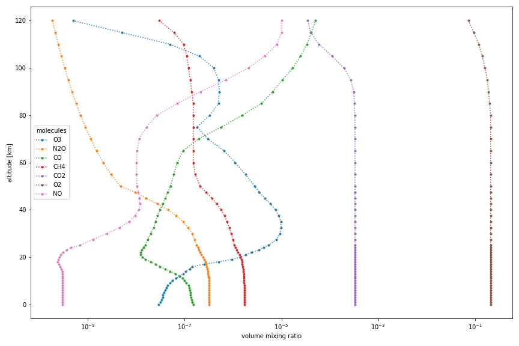

Usage
=====

Joseki brings together datasets of thermophysical properties of Earth's atmosphere
relevant for radiative transfer applications, and provides utilities to compute common
characteristic quantities and perform operations such as interpolation and rescaling
on generated atmospheric thermosphysical property datasets.

Basics
------

The main interface of Joseki is the :func:`~joseki.make` function.
It creates an atmospheric profile corresponding to a given identifier.
For example, the so-called *AFGL US Standard* atmospheric profile
:cite:p:`Anderson1986AtmosphericConstituentProfiles` is created with:

.. code:: python

    import joseki

    ds = joseki.make(identifier="afgl_1986-us_standard")

The list of valid identifiers can be accessed either using the :func:`~joseki.identifiers`
function:

.. code:: python

    joseki.identifiers()

or using the command-line interface:

.. code:: shell

    joseki --help

The created profile is returned as an xarray dataset which can then be exported to
various formats, *e.g.* NetCDF:

.. code:: python

    ds.to_netcdf("my_dataset.nc")

.. tip::

    For other formats, refer to the
    `xarray IO documentation <https://docs.xarray.dev/en/stable/user-guide/io.html>`_.

Altitude grid
-------------

You can specify the altitude grid for your atmospheric profile using the ``z``
argument of the :func:`~joseki.make` function. It accepts

* a :class:`pint.Quantity` instance:

  .. code:: python

      from joseki import unit_registry as ureg

      ds = joseki.make(
          identifier="afgl_1986-us_standard",
          z=[0, 10, 20, 30, 40, 50, 60, 70, 80, 90, 100] * ureg.km,
      )

* or a dictionary that holds keyword arguments passed to the
  :class:`pint.Quantity` constructor:

  .. code:: python

      ds = joseki.make(
          identifier="afgl_1986-us_standard",
          z={
              "value": [0, 10, 20, 30, 40, 50, 60, 70, 80, 90, 100],
              "units": "km",
          },
      )

.. note::

    Like Eradiate, Joseki uses Pint's
    :func:`application registry <pint.get_application_registry>` for easy
    integration in a Pint-powered environment.

All Pint quantity initialization patterns are supported, such as using a Numpy
array to specify the altitude grid:

.. code:: python

    import numpy as np

    ds = joseki.make(
        identifier="afgl_1986-us_standard",
        z=np.linspace(0, 100, 51) * ureg.km,
    )

If the source atmospheric profile is based on tabulated data, it will be
interpolated on the specified altitude grid.

When interpolating, the column number densities associated with the different
atmospheric constituents will likely change. However, it is often desirable to
conserve total column number density, so that such resampling does not result in
a loss of mass. To ensure column densities are conserved during interpolation,
set the ``conserve_column`` parameter to ``True``:

.. code:: python

    ds = joseki.make(
        identifier="afgl_1986-us_standard",
        z=np.linspace(0, 100, 51) * ureg.km,
        conserve_column=True,
    )

Molecule selection
------------------

The optional ``molecules`` parameter can be used to restrict the list of molecules
included in the generated profile:

.. code:: python

    ds = joseki.make(
        identifier="afgl_1986-us_standard",
        molecules=["H2O", "CO2", "O3"],
    )

The atmospheric profiles defined by
:cite:t:`Anderson1986AtmosphericConstituentProfiles` include mole fraction
data for 28 molecules, where molecules 8-28 are described as *additional*.
By default, these additional molecules are included in the atmospheric profile.
To discard these additional molecules, set the ``additional_molecules``
parameter to ``False``:

.. code:: python

    ds = joseki.make(
        identifier="afgl_1986-us_standard",
        additional_molecules=False,
    )

The resulting dataset now includes only 7 molecules, instead of 28.

Derived quantities
------------------

Joseki can compute derived quantities from a thermophysical property profile
(either generated by Joseki, or externally). For that purpose, the ``joseki``
xarray accessor is the preferred interface. The following quantities can be
computed:

* column number density [:attr:`.JosekiAccessor.column_number_density`]:

  .. code:: python

      ds.joseki.column_number_density["O3"].to("dobson_unit")

* column mass density [:attr:`.JosekiAccessor.column_mass_density`]:

  .. code:: python

      ds.joseki.column_mass_density["H2O"]

* number density at sea level [:attr:`.JosekiAccessor.number_density_at_sea_level`]:

  .. code:: python

      ds.joseki.number_density_at_sea_level["CO2"]

* mass density at sea level [:attr:`.JosekiAccessor.mass_density_at_sea_level`]:

  .. code:: python

      ds.joseki.mass_density_at_sea_level["CH4"]

Rescaling
---------

The amount of one or several molecules in a thermophysical property dataset can be
modified with a rescaling transformation, using the :meth:`~.JosekiAccessor.rescale`
method:

.. code:: python

    rescaled = ds.joseki.rescale(factors={"H2O": 0.5, "CO2": 1.5, "CH4": 1.1})

This operator applies a multiplier to the current number densities for the
specified molecules.
When a rescale transformation is applied to a dataset, its ``history``
attribute is updated to keep track of the scaling factors that were applied.

Rescaling can also be parametrized by a target amount using the
:meth:`~.JosekiAccessor.rescale_to` method. In that case, Joseki computes and
applies the appropriate scaling factor:

.. code:: python

    rescaled = ds.joseki.rescale_to(
       target={
          "H2O": 25 * ureg("kg / m**2"),
          "CO2": 420 * ureg("ppm"),
          "O3": 280 * ureg("dobson_unit"),
       }
    )

Plotting examples
-----------------

The xarray library, which powers Joseki, offers various plotting features that
can be leverage to explore thermophysical property profiles. The following shows
a few examples that use the `Matplotlib library <https://matplotlib.org/>`_.

All dataset variables (air pressure ``p``, air temperature ``t``,
air number density ``n`` or species mole fractions ``x_*``) can be plotted
individually. Here are a few plotting code examples:

.. code:: python

    ds = joseki.make(
       identifier="afgl_1986-us_standard",
       additional_molecules=False,
    )

    ds.p.plot(
       figsize=(4, 8), ls="dotted", marker=".", y="z", xscale="log"
    )

.. figure:: fig/user_guide/plotting-p.png

.. code:: python

    ds.t.plot(
       figsize=(4, 8), ls="dotted", marker=".", y="z"
    )

.. figure:: fig/user_guide/plotting-t.png

.. code:: python

    ds.n.plot(
       figsize=(4, 8), ls="dotted", marker=".", y="z", xscale="log"
    )

.. figure:: fig/user_guide/plotting-n.png

.. code:: python

    plt.figure(figsize=(8, 8))

    for m in ds.joseki.molecules:
       ds[f"x_{m}"].plot(
          ls="dotted", marker=".", y="z", xscale="log"
       )

    plt.xlabel("mole fraction [dimensionless]")
    plt.legend(ds.joseki.molecules)

